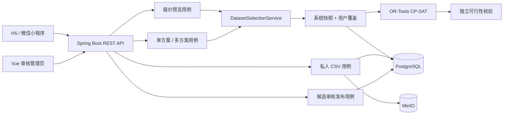

# 二手书回收决策系统

> 将多家回收平台不同的收书范围、报价和成单规则建模为约束优化问题，优先帮助用户处理掉最多实体书，而不是简单地逐本选择最高报价。

## 30 秒看懂项目

用户有一批待处理书籍时，单个平台往往只能回收其中一部分；把每本书都分配给报价最高的平台，又可能导致各平台订单无法达到最低金额、最低册数或均价门槛。

本系统先按 ISBN 展示各平台是否回收及预估价格，待用户确认整批书和数量后，再使用 OR-Tools CP-SAT 进行全局分配，输出推荐、省事、最佳单平台和金额最多等多种可解释方案。

默认推荐策略严格按照以下优先级优化：

```text
卖出册数最多 → 预估回收款最高 → 使用平台最少 → 订单数量最少
```

默认演示数据中，没有任何一家平台可以独立接收全部书籍，但跨平台组合可以卖出全部 11 本，用于直接展示组合决策的价值。

## 为什么不能使用简单贪心

“每本书选择报价最高的平台”只考虑局部价格，没有考虑订单之间的耦合关系：一本书分配到哪个平台，会影响其他书能否共同满足该平台的起收门槛。

项目需要同时处理：

- 每个平台对不同 ISBN 的接收状态和报价；
- 满金额、满册数、最低均价以及递归 `AND / OR` 门槛；
- 单笔最多本数、同 ISBN 每单复本限制和拆单；
- 卖出册数、金额、平台数和订单数之间的严格优先级；
- 多个平台、多本库存和多个候选订单之间的全局分配。

因此它不是逐本独立决策，而是一个离散约束优化问题。

## 用户流程

1. 扫描或输入 ISBN，查询当前数据快照中的平台报价；
2. 调整每种书的实际数量，形成完整库存；
3. 请求全局求解，获得多个去重后的售卖方案；
4. 查看每个平台的订单、书籍分配、预估回收款及未分配原因；
5. 可选上传固定格式的私人 CSV，使用自己的报价或与系统快照叠加求解。

## 四类决策方案

| 方案 | 词典序目标 | 用途 |
| --- | --- | --- |
| 推荐方案 | 册数 → 金额 → 平台数 → 订单数 | 默认选择，优先腾出空间 |
| 省事方案 | 册数 → 平台数 → 订单数 → 金额 | 在尽量卖完的前提下减少操作成本 |
| 最佳单平台 | 限制最多一个平台，再优化册数和金额 | 对比跨平台组合带来的增量 |
| 金额最多 | 金额 → 册数 → 平台数 → 订单数 | 展示价格取舍，允许为了金额少卖书 |

这里的多目标不是加权求和，而是分阶段求解并固定上一阶段结果。因此后面的金额提升不能牺牲前面已经确定的售出册数。

## 核心工程设计

### 约束优化

- 使用整数变量表示每个 ISBN 分配到各平台订单的数量；
- 使用布尔变量表示订单和平台是否启用；
- 把金额、册数、均价、复本和递归门槛编译为 CP-SAT 约束；
- 根据库存和订单门槛推导安全订单槽上界，并通过对称性消除减少等价搜索；
- 每个词典序阶段独立设置求解时限，区分 `OPTIMAL`、`FEASIBLE` 和 `UNKNOWN`；
- 使用独立 `SolutionValidator` 再次校验求解结果，不把“求解器返回”直接等同于业务正确。

### 数据版本与私人数据

- 使用不可变 `datasetVersion` 保存可复现的报价和规则快照；
- PostgreSQL + Flyway 管理公共数据版本，JSONB 保存递归订单门槛；
- 用户 CSV 采用固定中文八列协议，服务端严格校验文件、行数、ISBN、金额和枚举值；
- MinIO 保存原始文件，PostgreSQL 保存上传元数据和规范化报价行；
- capability token 仅保存哈希，私人数据默认保留 30 天；
- 支持 `SYSTEM_ONLY`、`USER_ONLY`、`USER_OVERLAY` 三种显式数据模式；
- 用户授权的数据只进入待审核队列，管理员审核后才能发布为新的不可变版本。

### 服务可用性

- 使用公平 `Semaphore` 为 CPU 密集型求解设置共享并发舱壁；
- 默认最多两个求解请求同时进入，满载时短暂等待后快速返回 `503`；
- 每个 CP-SAT 词典序阶段具有独立时限；
- 多方案接口设置策略边界总预算，避免一次请求连续放大为无界计算；
- 对上传文件、ISBN 数量、报价行数、上传频率和总存储量设置上界；
- MinIO 写入失败执行补偿删除，并以生命周期策略兜底清理临时对象。

## 系统架构



## 技术栈

| 层次 | 技术 |
| --- | --- |
| 后端 | Java 21、Spring Boot 4、Spring MVC、Spring Security、JdbcClient |
| 求解 | Google OR-Tools CP-SAT |
| 数据 | PostgreSQL 16、Flyway、JSONB、MinIO |
| 前端 | Vue 3、TypeScript、uni-app、Vite |
| 接口 | REST、RFC 7807 Problem Details、OpenAPI、Actuator |
| 测试 | JUnit 5、MockMvc、Testcontainers PostgreSQL / MinIO、真实 OR-Tools native 求解 |

## 项目结构

```text
Books/
├─ backend/                 Spring Boot 后端
│  ├─ application/         用例编排、数据选择、并发保护
│  ├─ domain/              平台、报价、库存和递归门槛模型
│  ├─ solver/              CP-SAT 建模、订单槽上界和结果校验
│  ├─ infrastructure/      PostgreSQL、MinIO 适配器
│  └─ web/                 REST、DTO、异常映射和管理端安全
├─ frontend/                uni-app + Vue 3 客户端
│  └─ src/pages/           用户首页、自定义数据页和审核页
└─ infra/                   本地基础设施配置
```

## 快速运行演示

### 环境要求

- JDK 21+
- Maven 3.9+
- Node.js 20+
- pnpm

默认模式从 classpath 加载固定演示快照，不需要先安装 PostgreSQL 或 MinIO。

### 启动后端

```bash
cd backend
mvn spring-boot:run
```

后端默认运行于 `http://localhost:8080`：

- Swagger：`http://localhost:8080/swagger-ui.html`
- 健康检查：`http://localhost:8080/actuator/health`

### 启动 H5

```bash
cd frontend
pnpm install
pnpm dev:h5
```

访问 `http://localhost:5173`。开发环境会把 `/backend` 请求代理到本地 Spring Boot。

微信小程序构建：

```bash
pnpm build:mp-weixin
```

将 `frontend/dist/build/mp-weixin` 导入微信开发者工具即可继续配置 AppID 和后端地址。

### 运行测试

```bash
cd backend
mvn clean test
```

完整后端测试包含 PostgreSQL 和 MinIO Testcontainers，需要 Docker 正在运行。

```bash
cd frontend
pnpm typecheck
pnpm build:h5
pnpm build:mp-weixin
```

### 启用 PostgreSQL、MinIO 和管理端

复制无凭据的配置模板：

```bash
cp backend/config/application-local.example.yml backend/config/application-local.yml
```

准备 PostgreSQL 16 数据库，通过环境变量提供数据库、MinIO 和管理员凭据，再使用 `postgres` profile 启动。真实的 `application-local.yml` 已被 `.gitignore` 排除。

```bash
cd backend
mvn spring-boot:run -Dspring-boot.run.profiles=postgres
```

启用管理 API 后，审核页面位于：

```text
http://localhost:5173/#/pages/admin/index
```

## 主要接口

| 接口 | 作用 |
| --- | --- |
| `GET /api/v1/demo/catalog` | 读取版本化演示书目 |
| `POST /api/v1/books/offers:lookup` | 批量预览平台报价，不执行求解 |
| `POST /api/v1/decisions` | 按指定策略生成单个方案 |
| `POST /api/v1/decision-options` | 生成并去重四类候选方案 |
| `POST /api/v1/user-datasets/uploads` | 上传并规范化私人 CSV |
| `GET / DELETE /api/v1/user-datasets/uploads/{uploadId}` | 查询或删除私人数据 |
| `/api/v1/admin/user-datasets/candidates/**` | 审核、拒绝或发布候选数据 |

## 数据与产品边界

- 当前没有接入任何平台的实时 API，也不会抓取或破解小程序；
- 默认 `mixed-demo-v1` 明确标记为 `MIXED`，公开响应使用平台 A～E；
- ISBN 和规则形状来自带日期的人工观察，演示报价、状态和复本覆盖为固定合成数据；
- 输出金额是下单前的预估回收款，不包含到仓复检、品相降价和退回费用；
- 本项目是可部署的决策原型，不是交易平台，也不代表获得任何回收平台授权。

## 许可证

本仓库用于作品展示和技术交流。除非后续明确添加软件许可证，否则不授予复制、修改、分发或商业使用本项目代码的许可。
